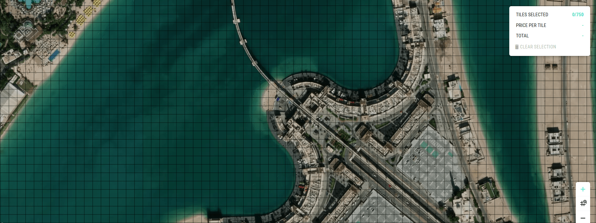

# Earth2.io Scraper
Up-to-date [earth2.io](https://earth2.io/) data



# Details
- [earth2.io](https://earth2.io/) data `(tile prices per country)` is automatically scraped and hosted in this repo daily.
- As an example, you can access to the scraped info of Italy `(IT)` for 20th February 2021 `(20210220)` at:

[https://raw.githubusercontent.com/fcakyon/earth2-scrapper/main/data/20210220/IT](https://raw.githubusercontent.com/fcakyon/earth2-scrapper/main/data/20210220/IT)

# Consuming API
When your backend is in Python i.e. in Django/Flask/FastAPI, you can access the JSON file’s data as shown below:

```python
import urllib.request, json

github_link = "https://raw.githubusercontent.com/fcakyon/earth2-scrapper/main/data/20210220/IT"

with urllib.request.urlopen(github_link) as url: 
   json_data = json.loads(url.read().decode())
   
print(json_data)
```

And if you want data in JavaScript using JQuery/React, you can access the JSON file’s data as shown below:
```js
let github_link = "https://raw.githubusercontent.com/fcakyon/earth2-scrapper/main/data/20210219/IT";

$.getJSON(github_link, function(data) {
     //data is the JSON string
     console.log(data);
});
```
